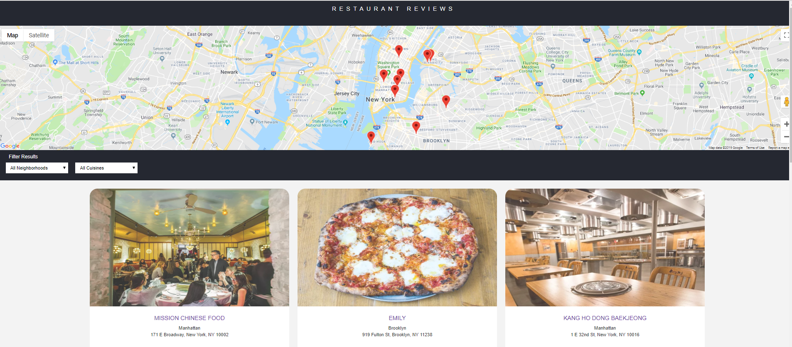

# Restaurant Reviews Project

## Project Overview:

 The  goal of **Restaurant Reviews** project is to convert a static webpage to a mobile-ready web application. The site should be responsive on different sized displays and accessible for screen reader use. It will also include a service worker to begin the process of creating a seamless offline experience for the users.

## How to run?

1. Download the `ZIP` file
or clone the project `git clone https://github.com/khaled-ansary/Restaurant-Review-js.git`
2. In this folder, start up a simple HTTP server to serve up the site files on your local computer. Python has some simple tools to do this, and you don't even need to know Python. For most people, it's already installed on your computer.

    * In a terminal, check the version of Python you have: `python -V`. If you have Python 2.x, spin up the server with `python -m SimpleHTTPServer 8000` (or some other port, if port 8000 is already in use.) For Python 3.x, you can use `python3 -m http.server 8000`. If you don't have Python installed, navigate to Python's [website](https://www.python.org/) to download and install the software.
   * Note -  For Windows systems, Python 3.x is installed as `python` by default. To start a Python 3.x server, you can simply enter `python -m http.server 8000`.
3. With your server running, visit the site: `http://localhost:8000`

## Live Version
You can find a live version of the project [here](https://khaled-ansary.github.io/Restaurant-Review-js/)

## Screenshot

## Dependencies

* Google Maps API [https://cloud.google.com/maps-platform/]
* ServiceWoker [https://developer.mozilla.org/en-US/docs/Web/API/Service_Worker_API/Using_Service_Workers]
  
### License

The MIT License

Copyright (c) Md Khaled Hossain Ansary

[License](LICENSE.md)